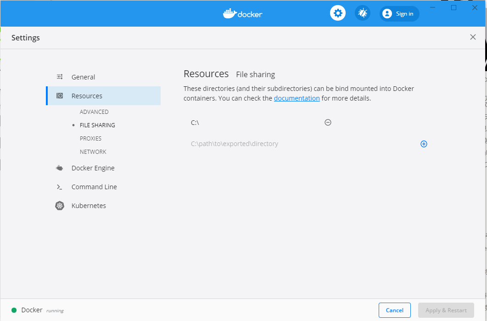

# README
## Docker for Windowsでの環境構築について
### docker-compose upをしたときに下記のエラーが出た
    ERROR: for app  Cannot create container for service app: status code not OK but 500:     ����          "System.UnauthorizedAccessException     ClassNameMessageDataInnerExceptionHelpURLStackTraceStringRemoteStackTraceStringRemoWatsonBuckets  System.Collections.IDictionarySystem.Excepti   "System.UnauthorizedAccessException   ]ア クセスが拒否されました。 (HRESULT からの例外:0x80070005 (E_ACCESSDENIED))

### 原因
Dockerのファイル共有の設定が抜けていた。

Settings/Resources/FILE SHARINGにC:\を追加して解消

